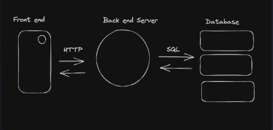

### Topics  
- SQL schema
- CRUD operations
- started CRUD project using postgreSQL 

### Notes  
-  what is schema? : blueprint of the database (the columns, data types, rows, constraints etc)
- what is a relational database in the first place?
    - data is stored so that each data point can be related to other data with ease
    - data is typically stored in the form of tables
    - each row in a relational table is called a record 
    - typically, each record has a unique id called primary key
- relational v non-relational databases
    - the fundamental difference is that nrd store data by nesting successively, rather than creating another table; they store records within other records 
    - non-relational databases come with their own flaws; the most important being, duplicacy. 
- CRUD
    - the bread and butter of every database.
    - CRUD operations map with HTTP methods like a glove. 
        - HTTP POST -> CREATE
        - HTTP GET -> READ
        - HTTP PUT -> UPDATE
        - HTTP DELETE -> DELETE
    - Auto increment: can be added to avoid manually entering for each record; if INTEGER PRIMARY KEY , then it is automatically applied
    - WHERE clause: allows to be hyper specific in a query and avoid any redundancy. some important once to keep in mind:
        - IS NULL/ IS NOT NULL
        - '=' to check ; I guess this is the most important
    - AS clause: allows to use alias for a piece of data in query
    - ORMs
        - tool which allows to perform CRUD using programming language , rather than writing manual SQL 
        - one has to go through the framework's code or documentation to use it effectively
    - Basic queries
        - is SQL a programming language ? you are kidding right.
        - SQL functions
            - IIF => kind of like ternery operator
        - Between, Distinct, Logical operators (you know the drill)
        - LIKE (%, _ ) ; regex is never ending. 
        - LIMIT (reduce the number of records returned using select statement)
        - ORDER BY (get data in ascending or descending order based on the column select)
        > note : if both order by and limit are used, then the order by clause must come first
    - Aggregations
        - single value that is derived by combining several other values
        - COUNT, SUM, MIN, MAX

    
- HTTP CRUD lifecycle
    
    - it is very important to understand how the data flows through a web application; the gateway , the processing and the where it arrives finally

- Golang Postgres CLI project
    - installed postgres and checked if it is working properly
    - setup git repository